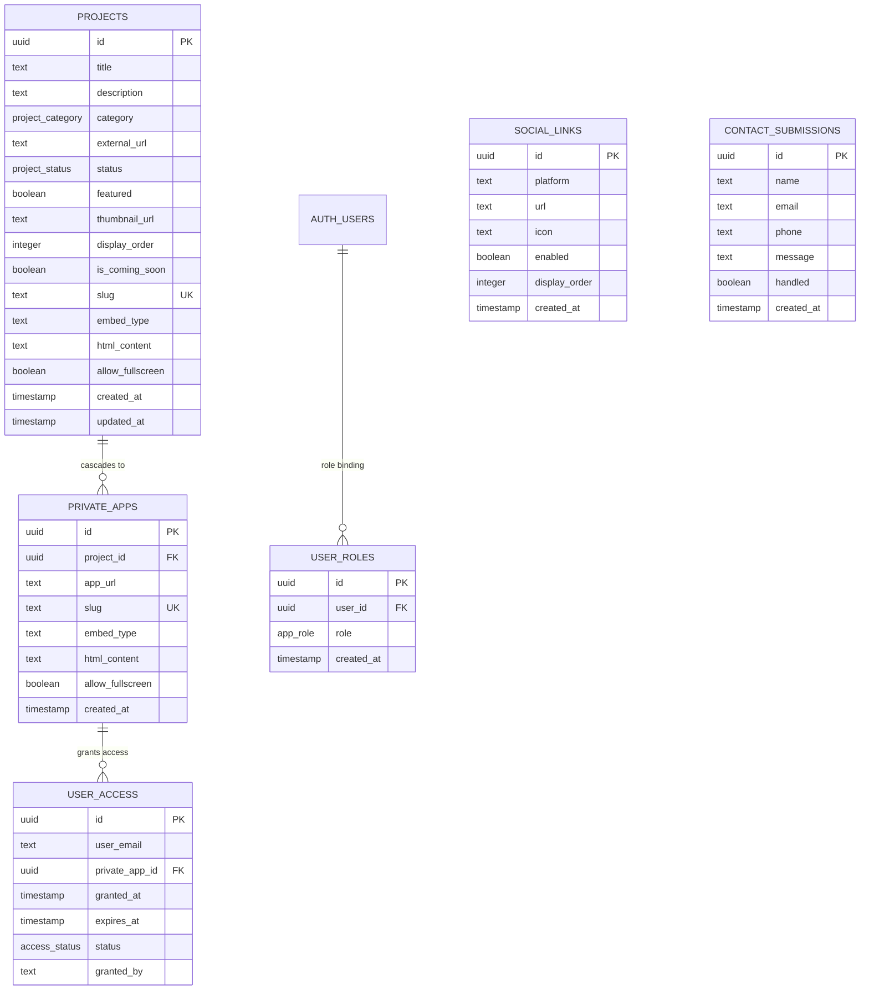

# 📘 StudyTube — Master Project Blueprint & Single Source of Truth (SSOT)

> **Document Version**: 2.0.0  
> **Last Updated**: October 2026  
> **Repository**: [studytube-web](https://github.com/riteshneha2011-commits/studytube-web)  
> **Author & Creator**: Ritesh Agarwal (IIT-trained Educator, 21+ Years Classroom Experience)  
> **Status**: Production Live · Fully Decoupled from Lovable Cloud · Self-Hosted Supabase & Vercel

---

## 1. Production Infrastructure & Verified Resources

| Resource | Value / Configuration | Notes & Verification |
|---|---|---|
| **Primary Domain** | `https://studytube.co.in` | Live production custom domain |
| **Vercel Staging URL** | `https://studytube-web.vercel.app` | Auto-deployed from GitHub `main` |
| **GitHub Repository** | `https://github.com/riteshneha2011-commits/studytube-web` | Collaborator: `riteshbhopal` |
| **Primary Branch** | `main` | Production deployment branch (Nitro engine) |
| **Supabase Project URL** | `https://yvcbhgftjwwjpzzxvmmr.supabase.co` | Standalone free-tier Postgres DB & Auth |
| **Supabase Project Ref** | `yvcbhgftjwwjpzzxvmmr` | Region: Asia (ap-south-1) |
| **Authentication Flow** | Passwordless Magic Link OTP & Password Login | Emails redirect to `/my-access` |
| **Admin Allowlist** | `ritesh.bhopal@gmail.com` | Hardcoded bypass + `public.user_roles` sync |
| **AI Gateway Key** | Google Gemini API (Free Google AI Studio key) | Server-side only via `GEMINI_API_KEY` |
| **Automated Keep-Alive** | `.github/workflows/keep-supabase-active.yml` | Cron runs every 3 days at 04:00 UTC |

---

## 2. Project Soul & Golden Directives (Core Working Rules)

### 🎯 2.1 The Soul of StudyTube
StudyTube is **not a generic EdTech startup**. It is a precision-engineered learning laboratory designed directly by **Ritesh Agarwal** (an IIT-trained teacher with 21+ years of classroom experience at Resonance Kota and Bhopal). Every tool, simulation, game, and practice portal is built to remove friction from complex Class 9–12, JEE & NEET physics, chemistry, and mathematics concepts.

### 📜 2.2 Golden Directives for AI Agents & Developers
1. **User Permission Protocol**:
   - Always propose, discuss, and align on architectural plans, UI redesigns, or database changes before writing or mutating code.
   - Never run destructive SQL (`DROP`, `TRUNCATE`, unindexed bulk `DELETE`) without explicit confirmation.
2. **Git & Lovable History Preservation Protocol**:
   - **NEVER** rewrite, amend, squash, or force-push commits that have already been pushed to `main`. This preserves synchronization integrity with connected tools.
   - Always verify build integrity with `npm run build` or `vite build` prior to committing.
3. **Communication Language Protocol**:
   - Communicate in the user's preferred language (Hindi / Hinglish / English friendly, respectful, and concise).
   - All code, variable names, database identifiers, TypeScript types, git commit messages, and documentation **must remain in clean, professional English**.
4. **Domain Truth & Pedagogical Integrity**:
   - Never hallucinate physics formulas, chemistry structures, syllabus topics, or student metrics.
   - Retain authentic CPK color standards (Oxygen = Red, Carbon = Charcoal, Hydrogen = White) and physical accuracy in simulations.

---

## 3. Database Architecture & Critical Performance Safeguards

### 🗄️ 3.1 Custom Enums
```sql
CREATE TYPE public.access_status AS ENUM ('active', 'expired', 'revoked');
CREATE TYPE public.app_role AS ENUM ('admin');
CREATE TYPE public.project_category AS ENUM ('Practice', 'Tools', 'Simulations', 'Games');
CREATE TYPE public.project_status AS ENUM ('visible', 'hidden', 'private');
```

### 📊 3.2 Tables & Relationships



### ⚡ 3.3 Known Performance Safeguards & Indexing
1. **Case-Insensitive Email Index**:
   - `CREATE INDEX IF NOT EXISTS user_access_email_idx ON public.user_access USING btree (lower(user_email));`
   - All email checks in RLS policies and queries **must** wrap with `lower(user_email) = lower(email)`.
2. **Postgres Row-Level Security (RLS)**:
   - `public.projects`: Anonymous & authenticated users can only view `status = 'visible'` rows. Admins can view/edit all.
   - `public.private_apps`: Accessible only if `public.is_admin()` is true OR a valid, unexpired row exists in `public.user_access` matching `auth.jwt() ->> 'email'`.
   - `public.contact_submissions`: Public can `INSERT` with strict length limits (`name <= 100`, `email <= 255`, `message <= 2000`). Only admins can `SELECT` and `UPDATE`.
3. **Keep-Alive Heartbeat**:
   - Free-tier Supabase pauses after 7 days of inactivity. The scheduled GitHub Action (`keep-supabase-active.yml`) sends a `GET /rest/v1/projects?select=id&limit=1` request every 72 hours.

---

## 4. Domain-Specific Business Logic & Historical Rules

### 🔐 4.1 Admin Authorization Bypass
- **Rule**: `ritesh.bhopal@gmail.com` is configured in `src/config/admin.ts` as the master administrator.
- **Implementation**:
  - In `src/hooks/use-auth.tsx`, if `session.user.email` matches `ritesh.bhopal@gmail.com`, `isAdmin` is immediately resolved to `true` on the client, eliminating race conditions while simultaneously syncing with `public.user_roles`.

### 🖥️ 4.2 Multi-Embed Application Modes
Each application or tool in `projects` and `private_apps` supports 3 embed strategies:
1. **`link`**: Opens externally in a new tab (`target="_blank"`). Used for third-party tools (e.g. `housie.riteshagarwal.in`, `pcmb.studytube.co.in`).
2. **`iframe`**: Embedded directly inside the `/app/$slug` route with auto-detection for `X-Frame-Options` blocks (with fallback modal to open in new tab).
3. **`html`**: Sandboxed inline HTML payload executed inside an isolated iframe for single-file games and interactive canvas experiments.

### 🧪 4.3 3D Chemistry CPK Standard Engine
- The chemistry simulator in `HeroInteractiveLab.tsx` renders real 3D Euler coordinate rotations (Yaw & Pitch) with depth-sorted painter's algorithm ($Z$-buffering).
- Follows international **CPK coloring**:
  - Oxygen = `#ef4444` (Vibrant Glossy Red)
  - Hydrogen = `#f1f5f9` (Crisp Silver White)
  - Carbon = `#334155` (Deep Charcoal)
  - Chlorine = `#10b981` (Emerald Green)
  - Nitrogen = `#3b82f6` (Royal Blue)

### 🌓 4.4 Theme Architecture
- Default `:root` CSS variables configure the crisp **"Modern Academic Lab" Light Mode** (`#f8fafc`).
- The `.dark` class on `<html>` activates the **"Deep Obsidian Slate" Dark Mode** (`#0a0e17` with neon cyan and violet glow utilities).
- Persisted in `localStorage` via key `studytube-theme` with pre-paint script `themeInitScript` in `src/routes/__root.tsx` to eliminate theme flash.

---

## 5. Codebase & Component Directory Map

```
Study Tube Website/
├── .github/
│   └── workflows/
│       └── keep-supabase-active.yml     # 72-hour automated Supabase heartbeat ping
├── public/
│   ├── studytube-logo.png               # Official brand logo
│   └── favicon.png                      # Browser favicon
├── src/
│   ├── assets/                          # Static media assets
│   ├── config/
│   │   └── admin.ts                     # Single source of truth for ADMIN_EMAILS allowlist
│   ├── hooks/
│   │   ├── use-auth.tsx                 # Supabase session + immediate Admin state hook
│   │   └── use-mobile.tsx               # Viewport responsive breakpoint detector
│   ├── integrations/
│   │   └── supabase/
│   │       ├── client.ts                # Browser Supabase client (LocalStorage session)
│   │       ├── client.server.ts         # Nitro SSR server client handler
│   │       ├── auth-middleware.ts       # Route guard middleware
│   │       └── types.ts                 # Generated TypeScript DB definitions
│   ├── lib/
│   │   ├── utils.ts                     # Tailwind class merge (clsx + tailwind-merge)
│   │   └── lovable-error-reporting.ts   # Error telemetry wrapper
│   ├── components/
│   │   ├── theme-provider.tsx           # Context provider for Light/Dark/System themes
│   │   ├── ui/                          # Radix UI + Tailwind primitive components
│   │   └── site/                        # StudyTube custom design components
│   │       ├── Header.tsx               # Glassmorphic top navigation with logo & theme toggle
│   │       ├── Footer.tsx               # Footer with subject directory & IIT pedigree
│   │       ├── HeroInteractiveLab.tsx   # 3 Live widgets (Physics Sim, 3D Molecule, Live Quiz)
│   │       ├── ProjectCard.tsx          # Neon tactile cards with category color coding
│   │       ├── FollowCTA.tsx            # Community and social update card
│   │       ├── SocialIcons.tsx          # Dynamic social links renderer
│   │       ├── ThemeToggle.tsx          # Sun / Monitor / Moon 3-state switcher
│   │       └── SiteLayout.tsx           # Standard wrapper (Header + Main + Footer)
│   ├── routes/
│   │   ├── __root.tsx                   # TanStack Root route, QueryClient, SEO head & font loaders
│   │   ├── index.tsx                    # Homepage: Hero, Interactive Labs, Bento grid, Stats
│   │   ├── projects.tsx                 # Full catalog: Subject filters, real-time search
│   │   ├── about.tsx                    # Teaching journey: 21+ Years IIT classroom philosophy
│   │   ├── contact.tsx                  # Contact form with interactive topic selector chips
│   │   ├── auth.tsx                     # Magic link passwordless + password login portal
│   │   ├── my-access.tsx                # Student portal for invited private apps
│   │   ├── admin.tsx                    # Full admin studio: Project editor, user access, inbox
│   │   ├── app.$slug.tsx                # In-app sandbox viewer with fullscreen controls
│   │   └── sitemap[.]xml.ts             # Dynamic XML sitemap generator
│   └── styles.css                       # Tailwind v4 theme, OKLCH color tokens & neon glows
├── supabase/
│   └── clean-setup.sql                  # Master DB migration: Enums, Tables, RLS, Seed Data
├── .env.example                         # Public environment variable template
├── AGENTS.md                            # Lovable synchronization safety guidelines
├── package.json                         # Dependencies & npm scripts
├── tsconfig.json                        # Strict TypeScript compiler options
└── vite.config.ts                       # Vite + TanStack Start + Nitro server configuration
```

---

## 6. Decision Log & Resolved Bug History (DO NOT REVERT)

| Issue / Feature | Root Cause | Permanent Architectural Solution | Status |
|---|---|---|---|
| **Lovable Cloud Lock-in** | Project was tied to Lovable Cloud brokered storage. | Migrated to standalone Supabase Cloud project (`yvcbhgftjwwjpzzxvmmr`). Replaced brokered storage with standard browser `localStorage`. | ✅ Resolved (DO NOT REVERT) |
| **Missing Admin Access** | Allowlist emails had race conditions checking `user_roles`. | Implemented immediate allowlist validation in `use-auth.tsx` & `admin.ts` for `ritesh.bhopal@gmail.com`. | ✅ Resolved (DO NOT REVERT) |
| **Light Mode Broken** | `:root` was assigned dark color tokens; `.light` class was unused. | Set `:root` to crisp Academic White/Slate and `.dark` to Obsidian/Neon. `theme-provider.tsx` toggles `.dark` class cleanly. | ✅ Resolved (DO NOT REVERT) |
| **Generic Chemistry Visualizer** | Previous placeholder displayed identical 4-arm cross for all molecules. | Built true 3D coordinate Ball-and-Stick multi-colored CPK renderer with depth sorting for Ethanol, Water, Benzene, Methane. | ✅ Resolved (DO NOT REVERT) |
| **Supabase 7-Day Auto-Pause** | Supabase free tier sleeps after 7 days without queries. | Added `.github/workflows/keep-supabase-active.yml` cron to send heartbeat pings every 72 hours. | ✅ Active (DO NOT REMOVE) |
| **Git History Rewriting** | Rebasing or amending breaks connected tools. | Strict rule: Only forward commits (`git add` $\rightarrow$ `git commit` $\rightarrow$ `git push origin main`). | ⚠️ Enforced |

---

## 7. New Session / AI Agent Quick Onboarding Checklist

When starting any new session or task in this repository, follow this **5-step checklist**:

1. **Verify Environment Variables**: Check `.env` contains `VITE_SUPABASE_URL` and `VITE_SUPABASE_PUBLISHABLE_KEY`.
2. **Review User Preferences**: Communicate in the user's preferred language (Hindi/Hinglish/English), but keep all code and commits in English.
3. **Respect Architectural Boundaries**: Propose design and schema modifications first; never run unapproved destructive SQL.
4. **Preserve Master Admin Flow**: Ensure `ritesh.bhopal@gmail.com` retains seamless access to `/admin`.
5. **Run Pre-Flight Build Check**: Always run `npm run build` or `vite build` before pushing to `origin main` to guarantee zero SSR or TypeScript breaks on Vercel.
